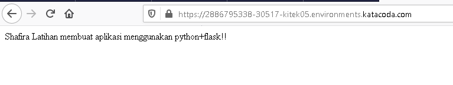

# Komponen- Komponen Kubernetes

  # Komponen Master

    Komponen master menyediakan control plane bagi klaster. Komponen ini berperan dalam proses pengambilan secara global pada klaster (contohnya, mekanisme schedule), serta berperan dalam proses deteksi serta pemberian respons terhadap events yang berlangsung di dalam klaster (contohnya, penjadwalan pod baru apabila jumlah replika yang ada pada replication controller tidak terpenuhi).

    Komponen master dapat dijalankan di mesin manapun yang ada di klaster. Meski begitu, untuk memudahkan proses yang ada, script inisiasi awal yang dijalankan biasanya memulai komponen master pada mesin yang sama, serta tidak menjalankan kontainer bagi pengguna di mesin ini. Contoh konfigurasi multi-master VM dapat dilihat di modul Membangun Klaster HA.
    kube-apiserver

    Komponen di master yang mengekspos API Kubernetes. Merupakan front-end dari kontrol plane Kubernetes.

    Komponen ini didesain agar dapat di-scale secara horizontal. Lihat Membangun Klaster HA.
    etcd

    Penyimpanan key value konsisten yang digunakan sebagai penyimpanan data klaster Kubernetes.

    Selalu perhatikan mekanisme untuk mem-backup data etcd pada klaster Kubernetes kamu. Untuk informasi lebih lanjut tentang etcd, lihat dokumentasi etcd.
    kube-scheduler

    Komponen di master yang bertugas mengamati pod yang baru dibuat dan belum di-assign ke suatu node dan kemudian akan memilih sebuah node dimana pod baru tersebut akan dijalankan.

    Faktor-faktor yang diperhatikan dalam proses ini adalah kebutuhan resource secara individual dan kolektif, konstrain perangkat keras/perangkat lunak/peraturan, spesifikasi afinitas dan non-afinitas, lokalisasi data, interferensi inter-workload dan deadlines.
    kube-controller-manager

    Komponen di master yang menjalankan kontroler.

    Secara logis, setiap kontroler adalah sebuah proses yang berbeda, tetapi untuk mengurangi kompleksitas, kontroler-kontroler ini dikompilasi menjadi sebuah binary yang dijalankan sebagai satu proses.

    Kontroler-kontroler ini meliputi:

        - Kontroler Node : Bertanggung jawab untuk mengamati dan memberikan respons apabila jumlah node berkurang.
        - Kontroler Replikasi : Bertanggung jawab untuk menjaga jumlah pod agar jumlahnya sesuai dengan kebutuhan setiap  objek kontroler replikasi yang ada di sistem.
        - Kontroler Endpoints : Menginisiasi objek Endpoints (yang merupakan gabungan Pods dan Services).
        - Kontroler Service Account & Token: Membuat akun dan akses token API standar untuk setiap namespaces yang dibuat.

    cloud-controller-manager

    Cloud-controller-manager merupakan kontroler yang berinteraksi dengan penyedia layanan cloud. Kontroler ini merupakat fitur alfa yang diperkenalkan pada Kubernetes versi 1.6.

    Cloud-controller-manager hanya menjalankan iterasi kontroler cloud-provider-specific . Kamu harus menonaktifkan iterasi kontroler ini pada kube-controller-manager. Kamu dapat menonaktifka iterasi kontroler ini dengan mengubah nilai argumen --cloud-provider dengan external ketika menginisiasi kube-controller-manager.

    Adanya cloud-controller-manager memungkinkan kode yang dimiliki oleh penyedia layanan cloud dan kode yang ada pada Kubernetes saling tidak bergantung selama masa development. Pada versi sebelumnya, Kubernetes bergantung pada fungsionalitas spesifik yang disediakan oleh penyedia layanan cloud. Di masa mendatang, kode yang secara spesifik dimiliki oleh penyedia layanan cloud akan dipelihara oleh penyedia layanan cloud itu sendiri, kode ini selanjutnya akan dihubungkan dengan cloud-controller-manager ketika Kubernetes dijalankan.

    Kontroler berikut ini memiliki keterkaitan dengan penyedia layanan cloud:

        - Kontroler Node : Melakukan pengecekan pada penyedia layanan cloud ketika menentukan apakah sebuah node telah dihapus pada cloud apabila node tersebut berhenti memberikan respons.
        - Kontroler Route : Melakukan pengaturan awal route yang ada pada penyedia layanan cloud
        - Kontroler Service : Untuk membuat, memperbaharui, menghapus load balancer yang disediakan oleh penyedia layanan cloud
        - Kontroler Volume : Untuk membuat, meng-attach, dan melakukan mount volume serta melakukan inetraksi dengan penyedia layanan cloud untuk melakukan orkestrasi volume

  # Komponen Node

    Komponen ini ada pada setiap node, fungsinya adalah melakukan pemeliharaan terhadap pod serta menyediakan environment runtime bagi Kubernetes.
    kubelet

    Agen yang dijalankan pada setiap node di klaster dan bertugas memastikan kontainer dijalankan di dalam pod.
    kube-proxy

    kube-proxy membantu abstraksi service Kubernetes melakukan tugasnya. Hal ini terjadi dengan cara memelihara aturan-aturan jaringan (network rules) serta meneruskan koneksi yang ditujukan pada suatu host.
    Container Runtime

    Container runtime adalah perangkat lunak yang bertanggung jawab dalam menjalankan kontainer. Kubernetes mendukung beberapa runtime, diantaranya adalah: Docker, containerd, cri-o, rktlet dan semua implementasi Kubernetes CRI (Container Runtime Interface).

  # Addons

    Addons merupakan pod dan service yang mengimplementasikan fitur-fitur yang diperlukan klaster.

    Beberapa addons akan dijelaskan selanjutnya.
    DNS

    Meskipun tidak semua addons dibutuhkan, semua klaster Kubernetes hendaknya memiliki DNS klaster. Komponen ini penting karena banyak dibutuhkan oleh komponen lainnya.

    Klaster DNS adalah server DNS, selain beberapa server DNS lain yang sudah ada di environment kamu, yang berfungsi sebagai catatan DNS bagi Kubernetes services

    Kontainer yang dimulai oleh kubernetes secara otomatis akan memasukkan server DNS ini ke dalam mekanisme pencarian DNS yang dimilikinya.
    Web UI (Dasbor)

    Dasbor adalah antar muka berbasis web multifungsi yang ada pada klaster Kubernetes. Dasbor ini memungkinkan user melakukan manajemen dan troubleshooting klaster maupun aplikasi yang ada pada klaster itu sendiri.
    Container Resource Monitoring

    Container Resource Monitoring mencatat metrik time-series yang diperoleh dari kontainer ke dalam basis data serta menyediakan antar muka yang dapat digunakan untuk melakukan pencarian data yang dibutuhkan.
    Cluster-level Logging

    Cluster-level logging bertanggung jawab mencatat log kontainer pada penyimpanan log terpusat dengan antar muka yang dapat digunakan untuk melakukan pencarian

# Membuat Deployment

Kubernetes Pod adalah sekelompok satu atau lebih kontainer, yang diikat bersama-sama untuk keperluan administrasi dan jaringan. Kubernetes memeriksa kesehatan Pod dan restart kontainer jika Pod berakhir atau mati. Pengerahan adalah cara yang disarankan untuk mengelola pembuatan dan penskalaan Pod. Deployment adalah cara yang disarankan mengelola pembuatan Pod.

1. Menggunakan kubectl untuk membuat Deployment yang mengelola Pod. Pod menjalankan Container berdasarkan gambar Docker yang disediakan. Pada praktik ini saya menggunakan gambar yang ada di praktik 8 yaitu Python+Flask

2. Melihat yang sudah di deploy dengan perintah kubectl get deployments dan akan muncul yang sudah di deploy, dan sudah muncul python+Flask

3. Melihat Pod dengan perintah kubectl get pods, dan sudah muncul Podnya

4. Melihat Cluster Event dengan perintah kubectl get events, dan akan muncul seperti gambar di bawah Instalasi

5. Melihat config yang sudah dijalankan dengan perintah kubectl config view

# Membuat Service

Secara default, Pod hanya dapat diakses oleh alamat IP internalnya di kluster Kubernetes. Agar Python Flask dapat diakses dari luar jaringan virtual Kubernetes, saya harus mengekspos Pod sebagai layanan Kubernetes.

1. Mengexpose pod pada internet public menggunakan perintah di bawah ini, setelah perintah dijalankan maka outputnya adalah service/pyton-flask exposed

2. Melihat service yang sudah saya buat dengan perintah kubectl get Service

3. Melihat hasil yang sudah kita buat dengan cara, klik tanda + kemudian masukkan port 30157, dan akan mengenerate, kemudian diarahkan ke hasil yang sudah kita buat.

